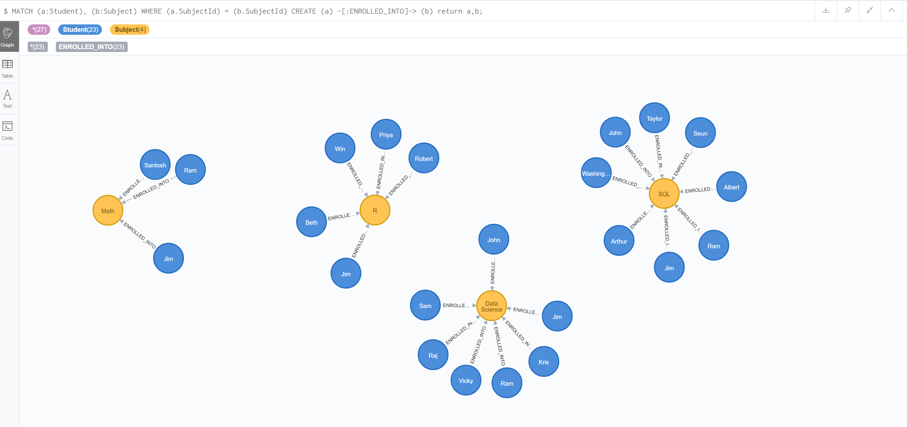

```{r setup, warning=FALSE}
knitr::opts_chunk$set(echo = TRUE)

library(RMySQL)
library(sqldf)
library(neo4r)

```

# CSV into MySQL
```{r}
dbConnection <- dbConnect(MySQL(), dbname="student_enrollment", user="root", password="root", host="localhost")
students_df <- read.csv("Students.csv",sep = ",")
subjects_df <- read.csv("Subjects.csv",sep = ",")
```

#MySQL into R Dataframes
```{r}

#Load dataframe into MySQL table
dbWriteTable(dbConnection, name="students_enrollments",value = students_df, overwrite=T)
dbWriteTable(dbConnection, name="subjects",value = subjects_df, overwrite=T)

#Now load MySQL data into dataframe
students_table_data <- dbReadTable(dbConnection, name="students_enrollments")
subjects_table_data <- dbReadTable(dbConnection, name="subjects")
```

#NoSQL Operations

##Open a NoSQL connection
```{r}

con <- neo4j_api$new( url = "http://localhost:7474",  user = "neo4j",  password = "admin" )
```

##Perform NoSQL operations
```{r}
#Clear any existing data
call_neo4j("MATCH (n) DETACH DELETE n", con)

cypher_query_student <- " "
#Now load the student data dataframe into Neo4J graph Cypher query
for(i in 1:nrow(students_table_data)) {
  cypher_query_student <- paste(cypher_query_student, "CREATE", vec_to_cypher(students_table_data[i, ], "Student"), " ")
}
cypher_query_student
call_neo4j(paste(cypher_query_student,";"), con)

cypher_query_subject <- " "
#Now load the subject data dataframe into Neo4J graph Cypher query
i <- 0
for(i in 1:nrow(subjects_table_data)) {
  cypher_query_subject <- paste(cypher_query_subject, "CREATE", vec_to_cypher(subjects_table_data[i, ], "Subject"), " ")
}
cypher_query_subject
call_neo4j(paste(cypher_query_subject,";"), con)

#Create a relationship between Student and Subject data
call_neo4j("MATCH (a:Student), (b:Subject) WHERE (a.SubjectId) = (b.SubjectId) CREATE (a) -[:ENROLLED_INTO]-> (b);", con)

```

##Neo4j graph


</br></br>


#Advantages: Relational Database (RDMS) vs Neo4j (NoSQL)

<b><u>Relational DB:</b></u> </br>
1.  Advantage: Data stored is very structured and easily related to different domains</br>
2.  Advantage: Strict data rules can be implemented</br>
3.  Advantage: Data is very reliable according to the preset data type.</br>

1.  Disadvantage: Very difficult to work with unstructured or semi-structured data</br>
2.  Disadvantage: Small change in data type or data format will not easily fit into database</br>
3.  Disadvantage: Very slow performance when the volume of data increases</br>

<b><u>NoSQL DB:</b></u></br>
1.  Advantage: Very easy to work with semi-structured data as well</br>
2.  Advantage: Dynamic schema i.e., Modifications into data types or data model is easily accomodated into NoSQL</br>
3.  Advantage: Very fast to deal with high volume data </br>

1.  Disadvantage: Difficult to maintain highly relational data</br>
2.  Disadvantage: Not mature enough to handle highly transactional data</br>
